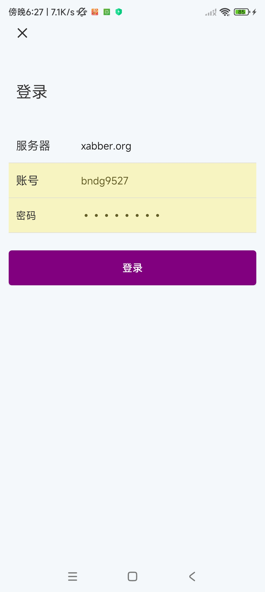
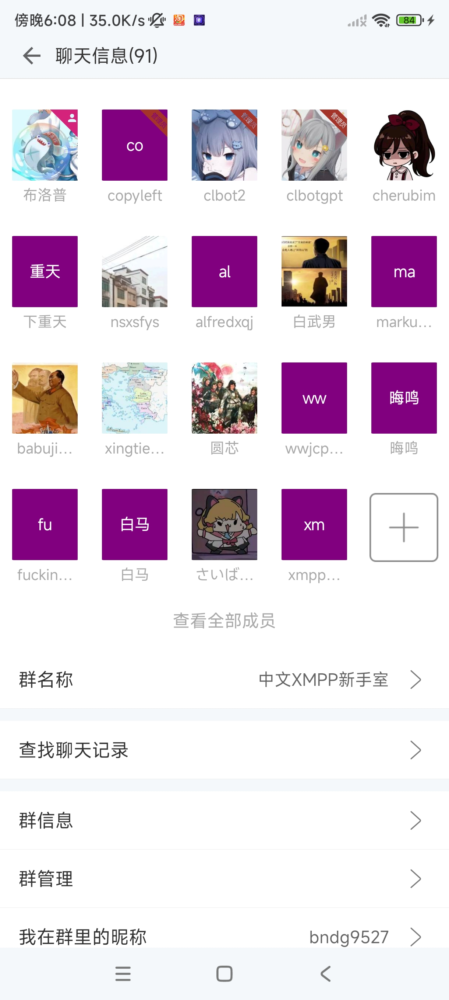
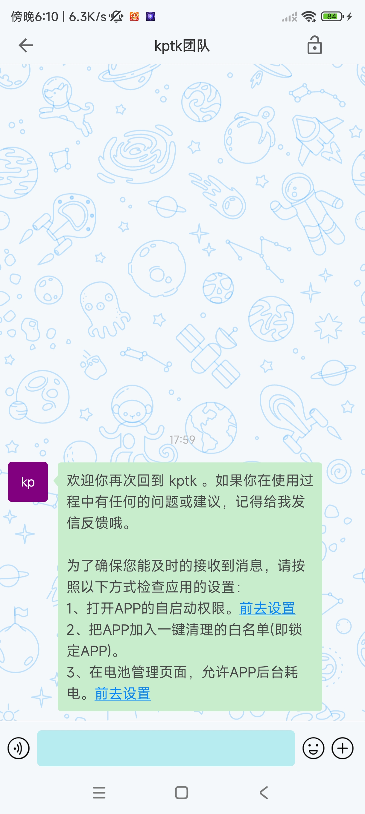

### 一个简单的 XMPP Android客户端

> 本项目是为了学习 XMPP 协议而写的一个app，实现了一些基本聊天功能，UI上参照了著名聊天。

#### 下载链接

https://wwhq.lanzouu.com/ivS6x2uy1bti
密码:7y2b

#### 推荐XMPP客户端

- [Conversations](https://codeberg.org/iNPUTmice/Conversations)
  稳定性好，功能完善，更新及时。只是UI操作和国内的聊天软件不同，需要习惯。
- [Monocles](https://f-droid.org/packages/de.monocles.chat/) 基于 Cheogram 和
  Conversations，但有很多变化和附加功能。
- [Xabber](https://github.com/redsolution/xabber-android) 老牌客户端，支持web ios
  android，虽然好久没更新但最近说有新版本。

#### 简介

- **XMPP（Extensible Messaging and Presence Protocol，扩展消息与在线状态协议）**
  是一种开源、基于XML的即时通讯协议，用于实现即时消息、在线状态以及多种通信功能。XMPP 最初由 **Jabber**
  作为开源即时通讯协议开发，后来被广泛应用于各种即时通讯和社交媒体平台。
- 更多信息参见[《XMPP 新⼿使⽤⼿册》](https://xmppjx.codeberg.page/xssysc.html)，介绍的十分详细。
- 利用Smack库实现了XMPP协议的聊天功能[Smack 库地址](https://github.com/igniterealtime/Smack)

#### 实现的功能

> 登陆时如果服务器是国外的可能会用时一二十秒。会不稳定。

- 登陆、注册（注册得看服务器是否开放了注册，建议去对应的平台上注册）
- 搜索好友(需要对方真实的jid)、好友的添加、删除、拉黑、在线状态等
- 单聊、群聊、群信息修改、群成员管理等
- 发送文字、图片、语音、文件、名片消息
- 图片编辑、录制视频
- 聊天记录搜索
- 会话置顶、免打扰
- 搜索公共频道
- 个人名片修改昵称、头像
- 多语言
- omemo(未完善)

#### 一些公共的 XMPP 服务器

- [conversations.im](http://conversations.im/)
- [yax.im](https://yaxim.org/yax.im/) ([Policy](https://yaxim.org/yax.im/tos/))
- [SUChat.org – Servidor XMPP](https://www.suchat.org/)
- 也可以自己搭建服务端，有很多开源服务端比如`tigase` `jabber`等

#### 一些截图

> 测试账号 服务器：xabber.org 账号：bndg9527 密码：bndg9527

<table>
    <tr>
       <td></td>
       <td></td>
       <td></td>
       <td></td>
    </tr>
    <tr>
       <td></td>
       <td></td>
       <td></td>
       <td></td> 
    </tr>
</table>

